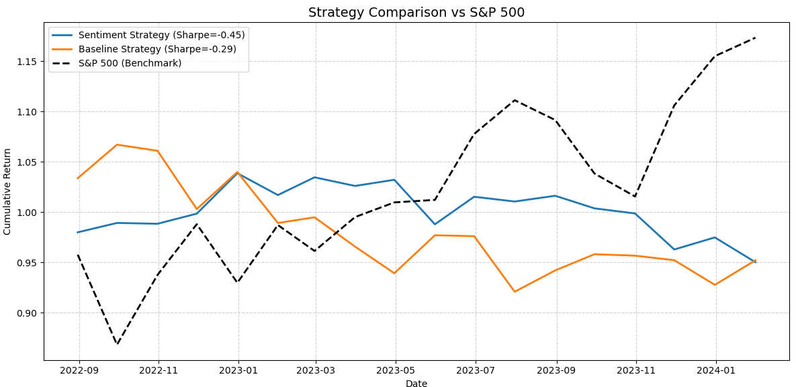

# 📈 Multi-Factor Equity Strategy: Baseline vs Sentiment-Driven Model

This project implements and compares two long-short equity trading strategies:

- **Baseline Model**: Momentum + Value (Price-to-Book)
- **Sentiment Model**: Momentum + Value + Simulated Sentiment Scores

Both models are monthly-rebalanced factor portfolios constructed using a universe of U.S. equities and evaluated over the period **2019–2024**.

---

## 🧠 Strategy Logic

### 🔹 Baseline Model
- **Momentum**: 6-month price return
- **Value**: Static Price-to-Book ratio from Yahoo Finance
- Portfolio is long the top 20% and short the bottom 20% based on the average z-score of the two factors.

### 🔹 Sentiment-Driven Model
- All components of the baseline model
- Simulated sentiment scores per stock per month (as proxy for real FinBERT pipeline)
- Scores range from -1 to 1, based on sentiment polarity

---

## 📈 Strategy Comparison

### Model Performance (2019–2024):

| Model       | Annual Return | Volatility | Sharpe |
|-------------|----------------|------------|--------|
| Sentiment   | -3.36%         | 7.45%      | -0.45  |
| Baseline    | -3.23%         | 11.11%     | -0.29  |
| S&P 500     | Positive (used as benchmark) | — | — |

- Both strategies underperform the S&P 500 during this period.
- The sentiment-driven model slightly improves volatility but shows no predictive edge with current simulated data.

---

## 📉 Visual Output

- The S&P 500 (black dashed) outperforms both strategies.
- Sharpe ratios are negative, indicating poor risk-adjusted returns in this backtest.

---

## 📁 Files Included

| File                         | Description                                      |
|------------------------------|--------------------------------------------------|
| `Baseline_Model1.py`         | Momentum + Value factor model                   |
| `Simulated_Sentiment_Model1.py` | Baseline + simulated sentiment factor model      |
| `comparison_script.py`       | Visualization of cumulative returns for both models side-by-side |

---

## 🔧 Tools & Libraries

- `pandas`, `numpy`, `matplotlib`, `scipy`
- `yfinance` for real price and P/B data
- `logging` for clean traceability
- Simulated sentiment generation with NumPy (replaceable with FinBERT)

---

## ⚠️ Limitations

- **No transaction cost modeling**
- **No walk-forward validation or hyperparameter tuning**
- **Static P/B ratios** (not time-series)
- Sentiment scores are **simulated**, not derived from actual headlines in this version

---

## 📌 Future Improvements

- Replace simulated sentiment with real FinBERT-based headline sentiment  
- Integrate walk-forward portfolio validation  
- Add turnover constraint and transaction cost model  
- Dynamic valuation metrics (e.g., forward P/E, EV/EBITDA)

---

## 📚 Educational Use

This project is meant for **educational and research purposes** to demonstrate factor-based modeling, not for live trading. Despite underperformance, it highlights:
- Strategy design and backtesting workflow  
- Factor combination and z-scoring  
- Benchmarking and visualization  
